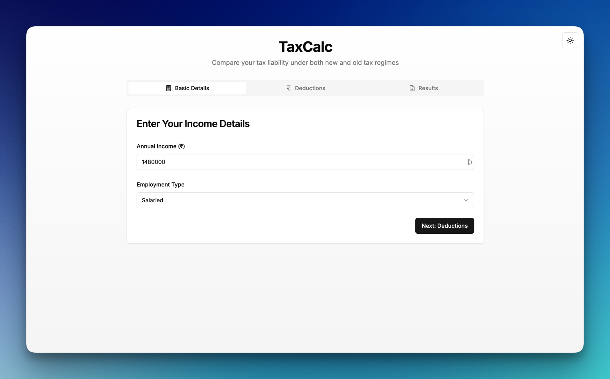
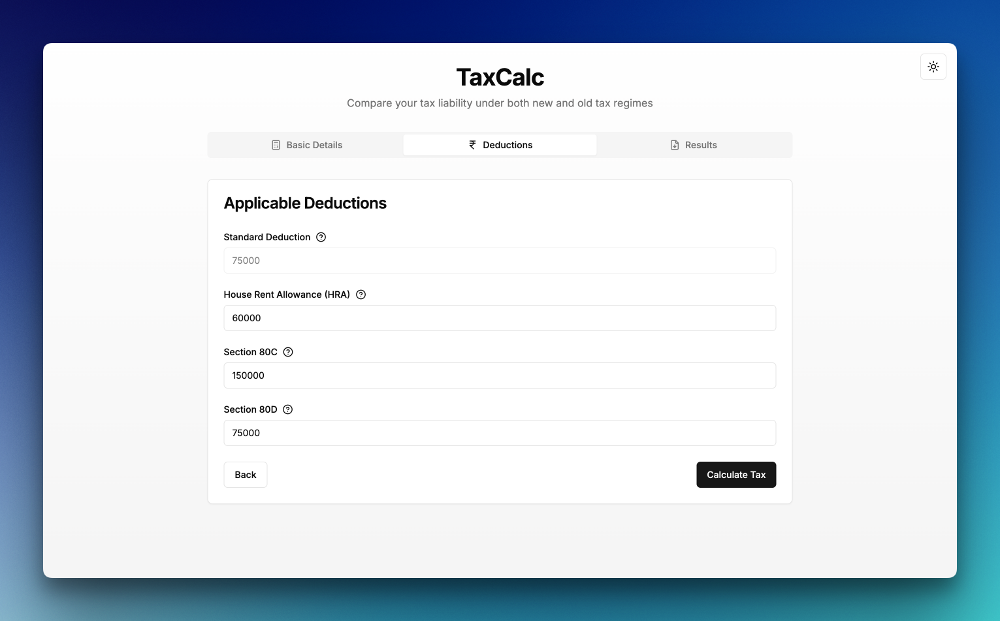
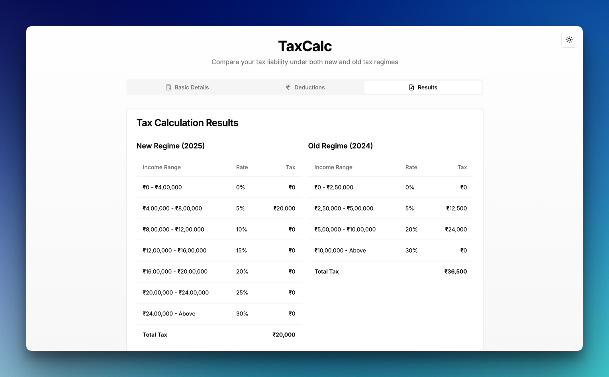
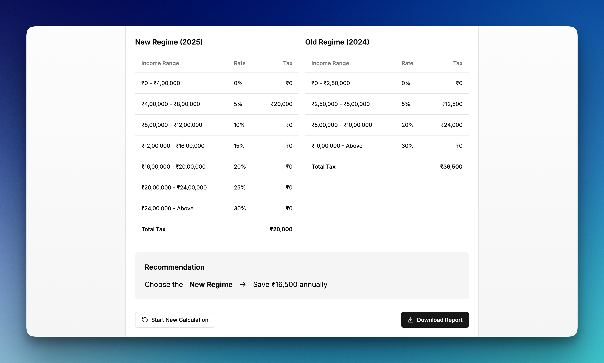

# TaxCalc

## Description

TaxCalc is a web application designed to calculate Indian income tax for the financial year 2025-26. It allows users to compare their tax liability under both the new and old tax regimes, helping them make informed decisions about tax planning.

## Features

- **Dual Regime Calculation:** Calculates income tax under both the New Regime (2025) and Old Regime (2024).
- **Comprehensive Input:**  Allows users to input their annual income and various applicable deductions like Section 80C, 80D, HRA, LTA, and NPS.
- **Detailed Results:** Presents a clear breakdown of tax calculation under both regimes, including tax slabs and total tax payable.
- **Recommendation Engine:**  Suggests the better tax regime based on the calculated tax liability and potential savings.
- **PDF Report Download:** Generates and allows users to download a detailed PDF report of their tax calculation for record-keeping.
- **User-Friendly Interface:** Built with a clean and intuitive user interface using modern React UI libraries.
- **Responsive Design:**  Works seamlessly on various devices, including desktops, tablets, and mobile phones.
- **Dark/Light Mode:** Supports both dark and light themes for user preference.

##Screenshots

  
  
<em>Home Screen with Income Input Form</em>

  
  
<em>Deductions Screen</em>

  
  
<em>Detailed Tax Calculation Results</em>

  
  
<em>Recommendation Screen</em>

## Technologies Used

- **Next.js:**  React framework for building user interfaces.
- **React:**  JavaScript library for building user interfaces.
- **TypeScript:**  Superset of JavaScript that adds static typing.
- **Tailwind CSS:**  Utility-first CSS framework for styling.
- **radix-ui:**  Accessible UI components for React.
- **react-hook-form:**  Library for form management in React.
- **zod:**  Schema validation library for TypeScript.
- **jspdf & jspdf-autotable:** Libraries for generating PDF documents in JavaScript.
- **lucide-react:**  Collection of beautiful SVG icons.
- **vercel/nextjs:** Deployment platform.

